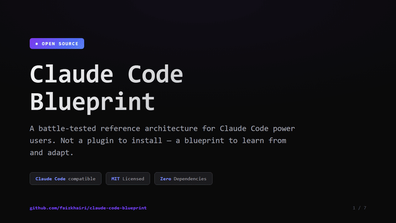

<div align="center">

# Claude Code Blueprint

**Prevent the most common AI coding mistakes — a library of ready-to-copy files (CLAUDE.md, hooks, agents) you mix into your own project to make Claude Code more reliable.**

60 seconds to start. Copy one file. Add more as your project grows. Works with any language, any framework, any skill level.

[](https://github.com/faizkhairi/claude-code-blueprint/stargazers)
[](https://github.com/faizkhairi/claude-code-blueprint/network/members)
[](LICENSE)
[](https://docs.anthropic.com/en/docs/claude-code)
[](CONTRIBUTING.md)

**12 agents** · **17 skills** · **12 hooks** · **6 rules** — copy only what you need, or install a preset (minimal / standard / core / full)

[English](README.md) | [日本語](i18n/README.ja.md) | [한국어](i18n/README.ko.md) | [简体中文](i18n/README.zh.md)



</div>

---

> **Heads up before you copy:** This is a reference repo, not a project template — you'll copy files OUT of it into your own project. Don't run Claude Code inside this repository (it'll load this blueprint's CLAUDE.md instead of yours). See [GETTING-STARTED.md](GETTING-STARTED.md) for the full walkthrough.

---

## Quick Start

Copy one file. Get three behavioral rules. Done in 60 seconds.

```bash
# In your project root
curl -o CLAUDE.md https://raw.githubusercontent.com/faizkhairi/claude-code-blueprint/main/CLAUDE.md
```

This gives Claude Code three rules that prevent the most common AI coding mistakes:

**Verify-After-Complete** · **Diagnose-First** · **Plan-First**

Ready for more? See the [full adoption path](#recommended-adoption-path) or the [30-minute beginner guide](GETTING-STARTED.md). New to Claude Code? See [who this is for](#who-is-this-for) or the [FAQ](FAQ.md).

**Want more than CLAUDE.md?** Install hooks, agents, and settings automatically:

```bash
# From a cloned/forked copy of this repo
./setup.sh --preset=standard
```

Or let Claude do it -- paste into a Claude Code session: *"Set up the Claude Code Blueprint. Copy CLAUDE.md to my project root, set up hooks and settings in ~/.claude/. Show me each step."*

See [SETUP.md](SETUP.md) for all setup options including a verification checklist.

---

## What It Costs You (Token Budget)

Every file you copy is a recurring per-session context cost. Here is what each component costs and when it loads, so you can decide what to add. Numbers are measured from the actual files (~4 characters per token):

| Component | Token Cost | When It Loads |
|-----------|-----------|---------------|
| **CLAUDE.md** | ~2,300 | Every session start |
| **An always-on rule** (session-lifecycle) | ~700 | Every session |
| **A path-scoped rule** (testing, schema, api) | ~850-1,450 | Only when editing matching files — otherwise **zero** |
| **A skill** (review-full, test-check, deploy-check) | ~480-1,070 | Only when its trigger phrase is used |
| **Hooks** (all of them) | **Zero** | They run outside Claude's context |
| **An agent** (per spawn) | Full context window | Only when you invoke it |

**The economics:** hooks cost zero tokens, and path-scoped rules cost nothing until you touch a matching file. The recurring baseline is just CLAUDE.md (~2,300 tokens, roughly 3-5% of a typical session) — and a single prevented redo cycle saves far more than that. See the [full breakdown and savings math](docs/BENCHMARKS.md#token-cost-per-component).

---

## Who Is This For?

**Any developer, any framework, any skill level.** The blueprint configures Claude Code's behavior -- it doesn't care what language or framework your project uses.

| You Are | Start Here | Time to Value |
|---------|-----------|---------------|
| **Complete beginner** | [Start Here](GETTING-STARTED.md#new-to-claude-code-start-here) | 1 minute: just copy CLAUDE.md |
| **Solo dev, small project** | [CLAUDE.md](CLAUDE.md) + 2 hooks | 5 minutes |
| **Small startup (2-5 devs)** | Above + shared rules + 2-3 agents | See [Team Setup](GETTING-STARTED.md#setting-up-for-teams) |
| **Established team (5+ devs)** | Full blueprint, adapted | Fork, customize, commit shared config |
| **Learning to code** | [GETTING-STARTED.md](GETTING-STARTED.md) only | Ignore agents/skills/memory until comfortable |
| **Coming from another tool** | [CROSS-TOOL-GUIDE.md](docs/CROSS-TOOL-GUIDE.md) | Concepts transfer; see *Copilot/Cursor in depth* sections |

### Your Progression

**Level 1 -- Start here (60 seconds)**
Copy CLAUDE.md into your project. Four behavioral rules. Immediate impact.

**Level 2 -- Add safety nets (5 minutes)**
Add 2-3 hooks. Zero token cost. Automated config protection and edit verification.

**Level 3 -- Customize as you grow (ongoing)**
Add agents, skills, rules, and memory as your workflow matures. The `core` preset is a good next step -- a curated set of review/test/deploy skills and two path-scoped rules, without the full specialist ecosystem. See [Presets](docs/PRESETS.md) for ready-to-copy configurations.

---

## What Makes This Different

Other repos dump dozens of agents on you. We give you **12** -- and explain why each one exists.

| This Blueprint | Generic Config Repos |
|---------------|---------------------|
| Every component has a [battle story](docs/WHY.md) explaining why it exists | Configs without context |
| [4 behavioral rules](CLAUDE.md) that prevent AI coding mistakes | Lists of settings to copy |
| [Cross-tool guide](docs/CROSS-TOOL-GUIDE.md) for 10 other tools (Copilot, Cursor, Cline, Roo Code, OpenCode, and more) | Single-tool only |
| [Beginner-friendly](GETTING-STARTED.md) with 6 adoption personas | Assumed expertise |
| [Smoke-tested hooks](hooks/test-hooks.sh) with 35 automated tests | Untested scripts |
| Safety-first: [config placement guide](GETTING-STARTED.md#where-config-belongs-project-vs-personal), privacy warnings, [graceful degradation](agents/README.md#agents-are-not-infallible) | No safety guidance |
| [Framework-agnostic](FAQ.md#what-framework-or-language-does-this-work-with): works with any language and stack | Assumes a specific language/framework |

---

## What's Inside

<details>
<summary><strong>12 Agents</strong> -- Specialized subagents with model tiering (opus/sonnet/haiku)</summary>

&nbsp;

| Agent | Model | Role |
|-------|-------|------|
| project-architect | opus | System design, architecture decisions, technology choices |
| backend-specialist | sonnet | API endpoints, services, database operations, middleware |
| frontend-specialist | sonnet | UI components, state management, forms, styling |
| code-reviewer | sonnet | Code quality, patterns, best practices (read-only) |
| security-reviewer | sonnet | OWASP Top 10, auth flaws, injection attacks (read-only) |
| db-analyst | sonnet | Schema analysis, query optimization, migration planning (read-only) |
| devops-engineer | sonnet | Deployment configs, CI/CD, Docker, infrastructure (read-only) |
| qa-tester | sonnet | Unit tests, integration tests, E2E tests |
| verify-plan | sonnet | 7-point mechanical plan verification (read-only) |
| docs-writer | haiku | README, API docs, changelogs, architecture docs |
| api-documenter | haiku | OpenAPI specs, integration guides (read-only) |

See [agents/README.md](agents/README.md) for permission modes, cost estimates, and maxTurns.

</details>

<details>
<summary><strong>17 Skills</strong> -- Natural-language-triggered workflows (no slash commands needed)</summary>

&nbsp;

| Category | Skills | Triggers |
|----------|--------|----------|
| Code Quality | review-full, review-diff | "is this secure?", "scan diff", "check for vulnerabilities" |
| Testing | test-check, e2e-check | "run the tests", "browser test", "are tests passing?" |
| Deployment | deploy-check | "deploy", "push to prod", "ready to ship" |
| Planning | sprint-plan, elicit-requirements | "let's build", "new feature", multi-step tasks |
| Session | load-session, save-session, session-end, save-diary | Session start/end, "save", "bye", "done" |
| Project | scaffold-project, register-project, status, changelog | "new project", "status", "changelog" |
| Database | db-check | "check the schema", "validate models" |
| Utilities | tech-radar | "what's new?", "should we upgrade?" |

See [skills/README.md](skills/README.md) for customization and placeholder variable setup.

</details>

<details>
<summary><strong>12 Hooks</strong> -- Deterministic lifecycle automation (always fire, unlike CLAUDE.md rules which the model can deprioritize)</summary>

&nbsp;

| Event | Hook | Purpose |
|-------|------|---------|
| SessionStart | session-start.sh | Inject workspace context |
| PreToolUse (Bash) | block-git-push.sh | Protect remote repos |
| PreToolUse (Write/Edit) | protect-config.sh | Guard linter/build configs |
| PostToolUse (Write/Edit) | notify-file-changed.sh | Verify reminder |
| PostToolUse (Bash) | post-commit-review.sh | Post-commit review |
| PreCompact | precompact-state.sh | Serialize state to disk |
| Stop | security check + cost-tracker.sh + session-checkpoint.sh | Last defense + metrics |
| SessionEnd | session-checkpoint.sh | Guaranteed final save |

Plus 2 utility scripts: `verify-mcp-sync.sh` (MCP config checker) and `status-line.sh` (branch/project status), both deployed by the full preset. The 13th file in the folder is `test-hooks.sh` — the local test harness, run via `bash hooks/test-hooks.sh` to verify all hooks. It's the only one not deployed to `~/.claude/hooks/`, and isn't counted in the "12 hooks" total.

Run `bash hooks/test-hooks.sh` to verify all hooks pass (35 automated tests).

See [hooks/README.md](hooks/README.md) for the full lifecycle, testing guide, and design principles.

</details>

<details>
<summary><strong>6 Rules</strong> -- Path-scoped behavioral constraints (load only when editing matching files)</summary>

&nbsp;

| Rule | Activates On | Purpose |
|------|-------------|---------|
| api-endpoints | `**/server/api/**/*.{js,ts}` | API route conventions |
| database-schema | `**/prisma/**`, `**/drizzle/**`, `**/migrations/**` | Schema design patterns |
| testing | `**/*.test.*`, `**/*.spec.*` | Test writing conventions |
| session-lifecycle | Always | Session start/end behaviors |
| memory-session | `**/memory/**` | Memory repository session management |

See [rules/README.md](rules/README.md) for creating custom rules.

</details>

**Also included:**

| Component | Purpose |
|-----------|---------|
| [**CLAUDE.md**](CLAUDE.md) | Battle-tested behavioral rules template |
| [**Settings Template**](examples/settings-template.json) | Full hook + permission configuration |
| [**Memory System**](memory/) | Built-in opt-in: Claude remembers preferences and session context across runs (git-ignored for privacy) |

---

## Philosophy

1. **Hooks for enforcement, CLAUDE.md for guidance** -- Hooks fire deterministically every time. CLAUDE.md instructions are followed most of the time, but not guaranteed -- the model can forget or deprioritize a rule. If something MUST happen, make it a hook.

2. **Agent-scoped knowledge, not global bloat** -- Design principles live in the frontend agent, not in every session's context. Security patterns live in the security-reviewer, not in CLAUDE.md.

3. **Context is currency** -- Every token loaded into context is a token not available for your code. Keep MEMORY.md under 100 lines. Extract to topic files. Use path-scoped rules so irrelevant rules don't load.

4. **Hooks are free, context is cheap** -- The 12 hook scripts cost zero tokens (they run outside Claude's context). CLAUDE.md adds ~2,300 tokens per session -- roughly 1-5% of a typical session. The blueprint saves more tokens than it costs by preventing redo cycles. See [BENCHMARKS.md](docs/BENCHMARKS.md#token-cost-per-component).

5. **Battle-tested over theoretical** -- Every rule in this repo exists because something went wrong without it. The "WHY" matters more than the "WHAT".

---

## Getting Started

### Option A: Fork (recommended)
Fork this repo to customize it as your own living reference. You can pull upstream updates later as the blueprint evolves.

### Option B: Clone + Copy
Clone the repo, then selectively copy components into your `~/.claude/` directory.

### Option C: Cherry-pick
Browse the repo on GitHub and copy only the specific files you need. No installation required.

### Option D: Automated Setup
Run `./setup.sh` from a cloned or forked copy. Choose a preset (minimal/standard/core/full) and the script handles directory creation, file copying, settings merge, and placeholder replacement. See [SETUP.md](SETUP.md).

### Recommended adoption path

1. **Start with [CLAUDE.md](CLAUDE.md)** -- the behavioral rules template. Biggest impact with zero setup.
2. **Add 2-3 hooks** -- [`protect-config.sh`](hooks/protect-config.sh) + [`notify-file-changed.sh`](hooks/notify-file-changed.sh) + [`cost-tracker.sh`](hooks/cost-tracker.sh). Copy to `~/.claude/hooks/` and wire into [`settings.json`](examples/settings-template.json).
3. **Read [WHY.md](docs/WHY.md)** to understand the reasoning -- adapt, don't blindly copy.
4. **Add agents** as your workflow matures -- start with `verify-plan` and `code-reviewer`.
5. **Set up the [memory system](memory/)** when you need cross-session persistence — opt-in during `./setup.sh` (answer Y).

---

## Deep Dives

| | | |
|:--|:--|:--|
| **[Architecture](docs/ARCHITECTURE.md)** | **[Settings Guide](docs/SETTINGS-GUIDE.md)** | **[Battle Stories](docs/WHY.md)** |
| System design, hook lifecycle, component relationships | Every env var, permission, and hook explained with rationale | The incidents and lessons behind every component |
| **[Benchmarks](docs/BENCHMARKS.md)** | **[Presets](docs/PRESETS.md)** | **[Cross-Tool Guide](docs/CROSS-TOOL-GUIDE.md)** |
| Token savings, cost impact, quality metrics | Ready-to-copy configs for solo, team, and CI/CD | Copilot, Cursor, Cline, Roo Code, OpenCode, and more (10 other tools) |
| **[FAQ](FAQ.md)** | **[Getting Started](GETTING-STARTED.md)** | **[Troubleshooting](TROUBLESHOOTING.md)** |
| Top community questions answered | From zero to productive in 30 minutes | Common issues and fixes |
| **[Setup Guide](SETUP.md)** | **[Case Studies](docs/CASE-STUDIES.md)** | **[Roadmap](docs/ROADMAP.md)** |
| Automated installer + verification checklist | Adopter stories and before/after metrics (submission-driven — be the first) | Project direction and what's next |
| **[Self-Monitoring](docs/SELF-MONITORING.md)** | | |
| Optional patterns: gitleaks pre-commit + memory-curator agent | | |

---

## Common Questions

**Works with my framework?** Yes. The blueprint is framework-agnostic -- it configures Claude Code, not your stack. [More...](FAQ.md#what-framework-or-language-does-this-work-with)

**Too advanced for me?** No. Start with one file (CLAUDE.md). Add more only when you need it. [More...](FAQ.md#im-a-juniorintermediate-developer-is-this-for-me)

**Which plan do I need?** Works on Pro, Max, Team, Enterprise, and API. Hooks are free on all plans. [More...](FAQ.md#which-claude-code-plan-do-i-need-does-this-work-with-pro--max--api)

**A colleague sent you this?** Start here: [quickstart for referrals](FAQ.md#a-colleague-sent-me-this-link-what-do-i-do-first).

---

<details>
<summary><strong>Plugin Compatibility</strong></summary>

&nbsp;

This blueprint is designed as a **standalone configuration** -- no plugins required. In fact, plugins can interfere with a custom setup:

**Known issues:**
- **Plugins that modify CLAUDE.md** may overwrite your custom behavioral rules
- **Plugins that add hooks** on the same events (e.g., Stop, PreToolUse) will stack with your hooks -- this can cause slowdowns or conflicting instructions
- **Plugins that inject context** consume tokens from your context window, leaving less room for your agents and memory system
- **MCP server plugins** work well alongside this setup -- they add tools, not rules, so there's no conflict

**Recommendation:** If you adopt this blueprint, audit your installed plugins and disable any that:
1. Override CLAUDE.md or settings.json hooks
2. Inject prompts on SessionStart (conflicts with your session-lifecycle rule)
3. Add broad permissions that bypass your permission restrictions

Custom setup > generic plugins, because your setup encodes YOUR project's domain knowledge. A plugin can't know your architecture, your team's conventions, or your production constraints.

</details>

---

## Acknowledgments

The memory system pattern in this blueprint was inspired by [Project-AI-MemoryCore](https://github.com/Kiyoraka/Project-AI-MemoryCore) by Kiyoraka — a comprehensive AI memory architecture with 11 feature extensions (LRU project management, memory consolidation, echo recall, and more). If you want a deeper, more feature-rich memory system than the lean built-in version here, check out that project.

**How they differ:** This blueprint covers the *full Claude Code configuration* (agents, skills, hooks, rules, settings) and ships a built-in opt-in memory in `memory/`. Project-AI-MemoryCore goes deep on the memory layer specifically — they're complementary, not competing.

## License

MIT
